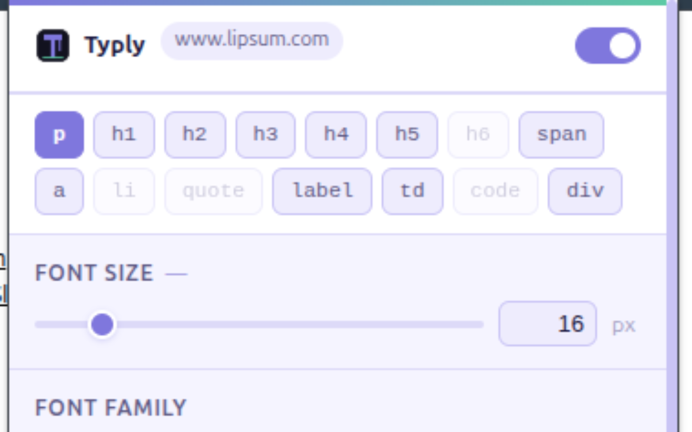
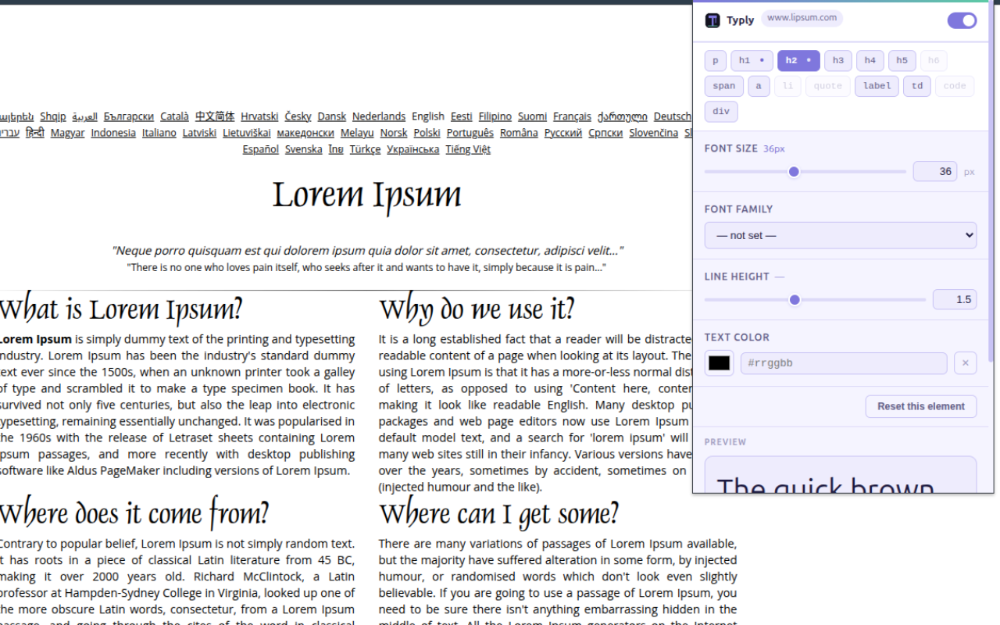

# Typly

A Chrome extension (Manifest V3) that lets you customize typography on any website — per element type, per domain.

Control **font size**, **font family**, **line height**, and **text color** for elements like `p`, `h1`–`h6`, `a`, `span`, `li`, `div`, `code`, and more, with changes saved automatically per site.

---

## Features

- **Per-element control** — apply different styles to different HTML element types on the same page
- **Per-domain settings** — customizations are saved per domain and restored automatically on every visit
- **Enable / disable per site** — toggle the extension on or off for any domain with one click
- **Live preview** — changes apply instantly as you adjust sliders or pick a color
- **Secure by design** — all values are validated and sanitized before being injected as CSS (XSS-safe)
- **No external dependencies** — plain JavaScript, no build step required

---

## Screenshots

| Popup UI                        | Example customization           |
| ------------------------------- | ------------------------------- |
|  |  |

---

## Installation

### Load unpacked (developer mode)

1. Clone or download this repository.
2. Open Chrome and navigate to `chrome://extensions`.
3. Enable **Developer mode** (toggle in the top-right corner).
4. Click **Load unpacked** and select the root folder of this repository.
5. The Typly icon will appear in your toolbar.

---

## Usage

1. Navigate to any website.
2. Click the **Typly** icon in the toolbar.
3. Select an element type from the tab bar (e.g. `p`, `h1`, `a`).
4. Adjust the **Font Size**, **Font Family**, **Line Height**, or **Color** controls.
5. Changes apply live and are saved automatically for that domain.

To disable Typly on a site, toggle the switch in the popup header.

---

## Project Structure

```
manifest.json          # Extension manifest (MV3)
background/
  service-worker.js    # Re-injects content script on navigation; forwards messages
content/
  content.js           # Reads rules from storage, generates CSS, injects <style>
popup/
  popup.html           # Extension popup UI
  popup.css            # Popup styles
  popup.js             # UI logic, storage reads/writes, messaging
icons/                 # Extension icons (16, 32, 48, 128 px)
tests/
  sanitizer.test.js    # Unit tests for CSS sanitization logic
  test-page.html       # Manual test page
```

---

## Supported Element Types

`p` · `h1` · `h2` · `h3` · `h4` · `h5` · `h6` · `span` · `a` · `li` · `blockquote` · `label` · `td` · `th` · `div` · `article` · `section` · `strong` · `em` · `b` · `i` · `small` · `code` · `pre`

---

## Running Tests

No dependencies required. Run the sanitizer unit tests with Node.js:

```bash
node tests/sanitizer.test.js
```

---

## Security

All user-provided values are validated before being written to CSS:

| Property      | Validation                                  |
| ------------- | ------------------------------------------- |
| `font-size`   | Must match `\d+(\.\d+)?px`, range 1–200     |
| `font-family` | Strips `;{}()<>\` characters, max 200 chars |
| `line-height` | Unitless number, range 0.5–5.0              |
| `color`       | Must be a 6-digit hex color (`#rrggbb`)     |

Element tag names are checked against an allowlist before being used in CSS selectors.

---

## Permissions

| Permission  | Reason                                                                |
| ----------- | --------------------------------------------------------------------- |
| `storage`   | Save and retrieve per-domain typography rules                         |
| `activeTab` | Read the current tab's domain and communicate with the content script |

---

## License

MIT
